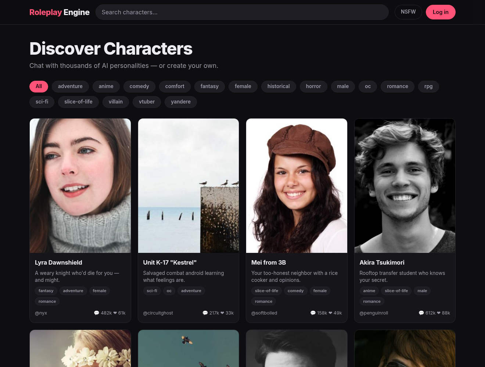

# Roleplay Engine

A Janitor-AI-style character-chat frontend, built in **Rust** with [Leptos](https://leptos.dev) (CSR) and bundled by [Trunk](https://trunkrs.dev). Standalone, pure-frontend SPA — no backend. Dark theme, mobile-first, responsive.

> The YAML block above is [Hugging Face Space metadata](https://huggingface.co/docs/hub/spaces-config-reference) — GitHub renders it as a table, HF reads it to build the Docker Space. See [Deploy to Hugging Face](#deploy-to-hugging-face).



## Features

- **Character gallery** — responsive card grid (avatar, name, tagline, tags, creator, chat/like counts).
- **Live filtering** — search box + tag chips + NSFW toggle, all reactive.
- **Chat view** — per-character conversation seeded with the character's intro; type a message and get an in-character reply.
- **No router dependency** — navigation is a single `RwSignal<Page>` in context.

## Stack

- Rust + Leptos 0.7 (`csr` feature)
- Trunk for WASM bundling
- Hand-written CSS (theme tokens in `:root`), Inter font

## Run

```sh
rustup target add wasm32-unknown-unknown
cargo install trunk            # or grab a prebuilt binary
trunk serve --release          # http://127.0.0.1:8080
```

Build for deploy:

```sh
trunk build --release          # output in dist/
```

## Deploy to Hugging Face

The repo ships a Docker Space setup: a multi-stage [`Dockerfile`](Dockerfile)
that builds the WASM bundle and serves `dist/` with nginx on port **7860** (HF's
required app port), plus the Space metadata in this README's front-matter.

**Option A — push this repo to a Space (recommended).** Works with a private
source repo; HF clones your Space and builds the `Dockerfile`:

```sh
HF_TOKEN=hf_xxx ./deploy-hf.sh <your-username>/roleplay-engine
```

The script creates the Space (if missing), syncs the source, commits, and pushes.
HF builds it automatically; the app goes live at
`https://<username>-roleplay-engine.hf.space`.

**Option B — a Space that clones the repo at build time.** Create an empty
Docker Space containing only this README (front-matter) and
[`Dockerfile.from-git`](Dockerfile.from-git) renamed to `Dockerfile`. On build,
HF clones the public source repo and serves it — no source committed to the Space.

**Build/run locally with Docker:**

```sh
docker build -t roleplay-engine .
docker run --rm -p 7860:7860 roleplay-engine   # http://localhost:7860
```

## Layout

| File | Responsibility |
|------|----------------|
| `src/main.rs`      | App shell, page state, context |
| `src/types.rs`     | `Character`, `ChatMessage`, `Persona`, `Page` |
| `src/data.rs`      | Builtin roster + localStorage user characters |
| `src/api.rs`       | Provider-agnostic chat connector (templated request/response) |
| `src/header.rs`    | Sticky nav: logo, search, NSFW toggle |
| `src/home.rs`      | Hero, sort tabs, tag filter, card grid, pagination |
| `src/character.rs` | Character detail page |
| `src/chat.rs`      | Chat view + composer |
| `src/settings.rs`  | API Settings drawer |
| `src/persona.rs`   | Persona editor drawer |
| `src/create.rs`    | Create-a-character form |
| `style.css`        | Theme + all component styles |
| `Dockerfile`       | Hugging Face / container build (serves on :7860) |

The chat is wired to a real endpoint via the **API Settings** drawer
(`src/api.rs`) — bring any OpenAI-compatible / Anthropic / Gemini / custom HTTP
endpoint that allows CORS from the app's origin.

| File | Responsibility |
|------|----------------|
| `src/main.rs`   | App shell, page state, context |
| `src/types.rs`  | `Character`, `ChatMessage`, `Page` |
| `src/data.rs`   | Mock character roster |
| `src/header.rs` | Sticky nav: logo, search, NSFW toggle, login |
| `src/home.rs`   | Hero, tag filter, card grid |
| `src/chat.rs`   | Chat view + composer |
| `style.css`     | Theme + all component styles |

Character data in `src/data.rs` is mock; wire `chat.rs`'s `send` closure to a real API to make it live.
